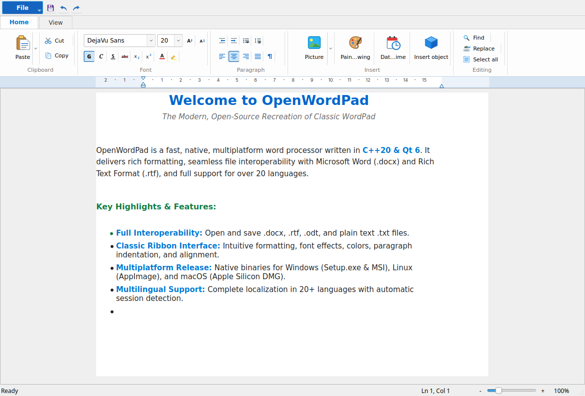
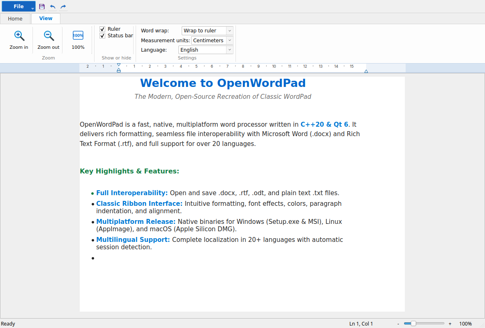
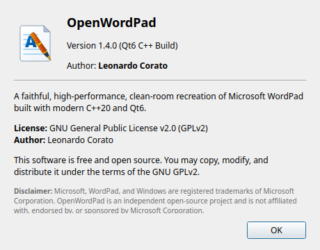
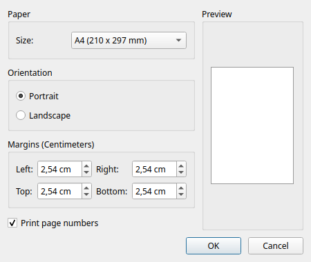

# OpenWordPad

[](LICENSE)
[](https://en.cppreference.com/w/cpp/20)
[](https://www.qt.io/)
[](https://github.com/leocor/openwordpad/actions/workflows/release.yml)
[](https://github.com/leocor/openwordpad/releases)

A faithful, high-performance, clean-room recreation of **Microsoft WordPad** built in modern C++ (C++20) and Qt6. OpenWordPad brings back the simplicity, speed, and clean interface of classic Windows document editing across **Linux**, **Windows**, and **macOS**.

**Author**: Leonardo Corato  
**License**: GNU General Public License v2.0 (GPLv2)  

---

## 📸 Screenshots

### Main Editor & Home Ribbon


### View Ribbon & Customization


<p align="center">
  
  
</p>

---

## 📥 Ready-to-use Downloads (Releases)

Download the latest version directly from the **[Releases Page](https://github.com/leocor/openwordpad/releases/latest)**:

* 🍏 **macOS (Apple Silicon M1 / M2 / M3 / M4)**:
  * **[OpenWordPad-macOS-AppleSilicon.dmg](https://github.com/leocor/openwordpad/releases/latest)** (Native Disk Image with Drag & Drop to Applications)
  * **[OpenWordPad-macOS-AppleSilicon.zip](https://github.com/leocor/openwordpad/releases/latest)** (Portable `.app` bundle)
* 🪟 **Windows (10 / 11 / Windows Server)**:
  * **[OpenWordPad-Windows-x64-Setup.exe](https://github.com/leocor/openwordpad/releases/latest)** (Multilingual Setup Wizard with Desktop & Start Menu shortcuts)
  * **[OpenWordPad-Windows-x64.zip](https://github.com/leocor/openwordpad/releases/latest)** (Portable standalone ZIP archive)
* 🐧 **Linux (x86_64)**:
  * **[OpenWordPad-Linux-x86_64.AppImage](https://github.com/leocor/openwordpad/releases/latest)** (Standalone portable AppImage, double-click to run on any distro)
  * **[OpenWordPad-Linux-x86_64.tar.gz](https://github.com/leocor/openwordpad/releases/latest)** (Compressed tarball with AppImage, metadata, and icons)

---

## ✨ Features

- 🎨 **Faithful Ribbon Interface**: Quick Access Toolbar, Blue Application Menu, Home tab, View tab, and interactive status bar.
- 🌐 **Multilingual Localization**: Complete support for over 20 languages (English, Italian, Spanish, French, German, Portuguese, Russian, Japanese, Chinese, etc.) with automatic OS session language detection.
- 📐 **Interactive Measurement Ruler**: Draggable Left/Right margins, First Line Indent, Hanging Indent, and dynamic unit switching (Centimeters, Inches, Points, Picas).
- 📝 **Rich Text Formatting**: Font families, font sizes, bold, italic, underline, strikethrough, subscript, superscript, color palettes, and highlight swatches.
- 📄 **Paragraph & Layout Tools**: Line spacing (1.0 to 2.0 + 10pt space after), multi-level bullet and numbered lists, alignments, and full Page Setup.
- 🖼️ **Insert Features**: Insert / Change / Resize pictures, embedded Paint sketch canvas, and Date & Time dialog.
- 🔍 **Full Editing & Search**: Modeless Find & Replace dialogs with whole word and case sensitivity matching.
- 🔍 **Smooth Zooming**: Real-time Zoom slider from 10% to 500% with percentage presets.
- 📂 **Comprehensive Format Support**:
  - Rich Text Format (`.rtf`)
  - Office Open XML (`.docx`)
  - OpenDocument Text (`.odt`)
  - Plain Text (`.txt`) with UTF-8 / ANSI encoding
  - HTML (`.html`, `.htm`)
  - PDF Export (`.pdf`)

---

## 🚀 Building & Running

### Prerequisites
- CMake 3.16+
- Qt 6 (Widgets, Core, Gui, PrintSupport, Svg)
- Modern C++20 Compiler (GCC, Clang, or MSVC)
- Ninja (recommended)

### Compile on Linux (CachyOS / Arch / Ubuntu / Fedora)
```bash
cmake -B build -G Ninja -DCMAKE_BUILD_TYPE=Release
ninja -C build
./build/openwordpad
```

### Run Test Suite
```bash
ctest --test-dir build --output-on-failure
```

---

## 📜 Documentation & Specifications
- [User Manual](docs/MANUAL.md)
- [Requirements Specification (requirements.md / requirements.ms)](requirements.md)
- [Development Log (log.md)](log.md)

---

## ⚖️ License & Trademark Disclaimer

### License
OpenWordPad is free software licensed under the **[GNU General Public License v2.0 (GPLv2)](LICENSE)**.  
Copyright (C) 2026 Leonardo Corato.

### Trademark & Fair Use Disclaimer
* **WordPad**, **Microsoft Word**, and **Windows** are registered trademarks of **Microsoft Corporation** in the United States and other countries.
* **OpenWordPad** is an independent, clean-room open-source project created from scratch using open document specifications (RTF Specification, ISO/IEC 29500 DOCX, OASIS ODT) and standard open-source libraries (C++20, Qt6).
* OpenWordPad is **not affiliated with, endorsed by, sponsored by, or associated with Microsoft Corporation** in any way.
* All graphical assets and icons in this repository are original vector creations licensed under GPLv2.
